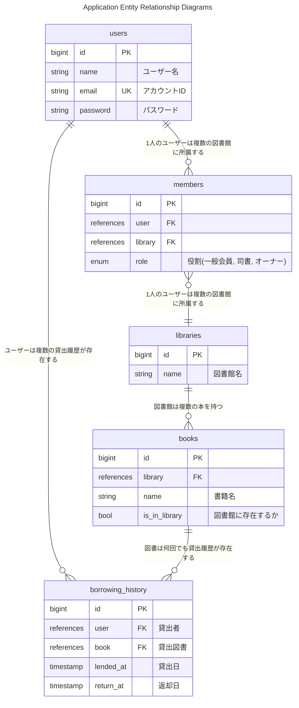

# ER図

```mermaid
---
title: Application Entity Relationship Diagrams
---
erDiagram
    users {
        bigint id PK
        string name "ユーザー名"
        string email UK "アカウントID"
        string password "パスワード"
    }

    members {
        bigint id PK
        references user FK
        references library FK
        enum role "役割(一般会員, 司書, オーナー)"
    }

    libraries {
        bigint id PK
        string name "図書館名"
    }

    books {
        bigint id PK
        references library FK
        string name "書籍名"
        bool is_in_library "図書館に存在するか"
    }

    borrowing_history {
        bigint id PK
        references user FK "貸出者"
        references book FK "貸出図書"
        timestamp lended_at "貸出日"
        timestamp return_at "返却日"
    }

    users ||--o{ members: "1人のユーザーは複数の図書館に所属する"
    members }o--|| libraries: "1人のユーザーは複数の図書館に所属する"
    libraries ||--o{ books: "図書館は複数の本を持つ"

    users ||--o{ borrowing_history: "ユーザーは複数の貸出履歴が存在する"
    books ||--o{ borrowing_history: "図書は何回でも貸出履歴が存在する"
```
